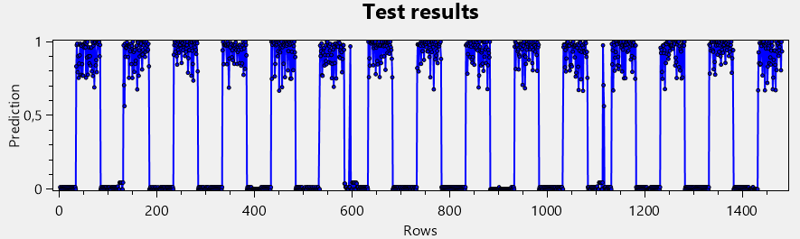

#  Simple DDoS IDS using MLP

RO: Acest proiect a avut ca scop crearea unei rețele neuronale simple (MLP), capabilă să detecteze un posibil atac DDoS. Ulterior, în jurul rețelei am construit o aplicație în C# .NET, similară unui IDS.

EN: This project aimed to create a simple neural network (MLP), capable of detecting a possible DDoS attack. Subsequently, we built an application in C#, similar to an IDS, around the network. This project aims to show that even a simple model can help us in detecting and mitigaiting these kind of attacks. 

---

## Cuprins

- [Despre proiect](#despre-proiect)
- [Etapele proiectului](#etape)
- [Functii](#functii)
- [Screenshots](#screenshots)
- [Usage](#usage)
- [Rezultate](#rezultate)
- [Viitor](#viitor)
- [Bibliografie/Referinte](#bibliografiereferinte)

---

## Despre proiect

Acest proiect implementează un sistem de detecție a atacurilor DDoS folosind o rețea neuronală de tip MLP (Multi-Layer Perceptron). Sistemul este capabil să detecteze pachete de rețea malițioase pe baza unor caracteristici cheie din pachetele care constituie traficul de retea. Vom nota cu 1 pachetele (liniile) malitioase, malgine, și cu 0 cele benigne.

Atenție! Această aplicație nu este menită să simuleze un IDS funcțional 100%, nici o rețea neuronală sofisticată/complexă. Unul dintre scopuri a fost să vedem care este minimul necesar d.p.d.v. software (resurse, arhitectură) pentru detecția unui astfel de atac. Astfel, este posibil să întălnim atât rezultate bune, cât și deficitare (mai ales că setul de date este creat de la 0; operăm cu numere mari -> fragmente, overfitting...).

Setul de date este rezultatul procesării datelor colectate în urma unui experiment rulat în Lab. 301 (CISCO Lab), din cadrul UMFST Tg. Mures. Am folosit hping3 pentru a simula 3 tipuri majore de atac DoS:

 1. TCP Syn Flood - atac care epuizeaza resursele victimei
 2. UDP Flood - atac volumetric
 3. ICMP Flood - atac volumetric, bazat pe ping

## Script atac

#!/bin/bash

	# ICMP:
 
hping3 -i u10000 -c 100000 -1 192.168.0.201

	# TCP:
 
hping3 -S -p 80 --flood 192.168.0.201

	# UDP:
 
hping3 --udp --flood --rand-source -p 53 192.168.0.201

Acest script a fost rulat simultan de restul PC-urilor din rețea.

## Topologia retelei 

Ținta atacului este PC-ul cu adresa IP: 192.168.0.201.

Am capturat atăt trafic curat, fără flooding, dar și 3 capturi aferente fiecărui tip de atac. Am utilizat Wireshark și, ulterior, am prelucrat fișierele utilizând scripturi Python (scapy, pandas).
Cu ajutorul acestora am:

 - extras și etichetat date aferente fiecărui tip de atac
 - amestecat datele cu trafic curat (pe blocuri de pachete și uniform)

## Strucutura datelor extrase

1. TCP - SYN Flood
   - src_ip : adresă IP sursă
   - dst_ip : adresă IP destinație
   - src_port : port sursă
   - dst_port : port destinație
   - seq: nr. de secvență (ordine pachete)
   - ack: acknowledgment rumber (confirmare de primire pachete)
   - window: mărimea ferestrei în care se pot primi date (pana la un nou ACK)
   - flags: diverse flag-uri pentru starea conexiunii TCP (ne interesează flag-ul 2 -> SYN)
   - packet_size: mărimea pachetului
   - ttl: time to live (câte hop-uri poate traversa un pachet)
   - label: 1 sau 0

3. UDP Flood
   - src_ip : adresă IP sursă
   - dst_ip : adresă IP destinație
   - src_port : port sursă
   - dst_port : port destinație
   - packet_size: mărimea pachetului
   - ttl: time to live (câte hop-uri poate traversa un pachet)
   - label: 1 sau 0

4. ICMP Flood
   - src_ip : adresă IP sursă
   - dst_ip : adresă IP destinație
   - packet_size: mărimea pachetului
   - ttl: time to live (câte hop-uri poate traversa un pachet)
   - ip_flags: flag pentru header-ul IP (DF sau MF)
   - fragment_offset: aparține sau nu pachetului original
   - ip_header_length: mărimea header-ului IP
   - ip_checksum: posibile pachete malformate
   - src_mac: adresă MAC sursă
   - dst_mac: adresă MAC destinație
   - label: 1 sau 0

Am obtinut fișiere Excel care vor servi rețeaua neuronală cu date de antrenament (70%) și de test (30%).

## Arhitectura rețelei neuronale

- stratul de intrare (cu nr. de neuroni egal cu numărul de coloane - caracteristici - din fișierul .excel)
- un strat ascuns (funcția de activare Sigmoid sau TanH, la alegere) (nr. de neuroni la alegere)
- stratul de ieșire (0 sau 1)

Aplicația conține :
- clasa Neuron
- clasa Neural_Network
- clasa principală, unde am definit restul funcțiilor, metodelor, grafice, visuals, etc.
  
---

## Etape
1. Am stabilit ce fel de atac dorim să detectăm -> DDoS.
2. Am stabilit tipurile de DoS (TCP-SYN, UDP, ICMP)
3. Am stabilit parametrii experimentului (hping3, topologie, etc.) și am colectat datele (Wireshark).
4. Am prelucrat datele -> scripturi Python -> am obținut fișiere Excel cu date și label-uri.
5. Am stabilit arhitectura rețelei (simplă, orientată spre eficiență și demonstrație).
6. Am creat rețeaua neuronală, elementele vizuale, funcționalități, grafice.
7. Am antrenat și testat aplicația / rețeaua neuronală.
8. Am colectat datele.

---

##  Functii

- detectarea traficului DDoS pe baza caracteristicilor de rețea / pe baza pachetelor 
- suport pentru fișiere .xlsx ca input
- posibilitate de alegere a parametriilor (nr. neuroni strat ascuns, nr. epoci, eroare maximă, rata de învățare)
- feedback asupra procesului de antrenare (per epocă)
- confusion matrix și grafic pentru observarea tiparului de atac (liniar, spike)
- atenționare în cazul detecției mai multor spike-uri (mai multe pachete maligne într-un segment de trafic)
- funcție de logging -> fișiere .txt cu detalii despre atac / pachete.
- posibilitate de salvare și încărcare ulterioară a modelului
- testare pe date fără label
- output binar 0 (normal) sau 1 (atac DDoS) -> clasificare

---

## Screenshots

Ecranul de start al aplicației.

Încărcarea datelor și normalizarea lor, dupa funcția de activare aleasă.

Procesul de antrenare.

Atenționare, afișată după procesul de testare.

Rezultatele testării.

Vizualizare rezultate testare.

Vizualizare rezultate, atac pe blocuri / spikes.

Cum arată fișierul cu modelul salvat (nr. neuroni intrare, strat ascuns, strat ascuns->ieșire).

Spikes

Consecutive Spikes

---

##  Usage

1. Colectăm trafic de rețea cu Wireshark.
2. Prelucrăm fișierul .pcap cu scriptul aferent din Python (în funcție de ce atac vrem să detectăm).
3. Încărcăm fișierul în aplicație. Atentie! Numărul de neuroni din startul de intrare trebuie să fie egal cu nr. de coloane din excel - 1 (coloana de label) -> setare din cod.
4. Alegem funcția de activare.
5. Normalizăm datele.
6. Setăm parametrii.
7. Antrenăm rețeaua.
8. Testăm.
9. Vizualizăm rezultatele / fișierele de logging.
10. Salvăm rețeaua.
11. Testăm cu date reale.

---

## Rezultate

Rezultatele sunt împărțite după: 
- tipul / nr. de date oferite
- aranjarea pachetelor (segmente sau uniforme)
- parametrii folosiți

Toate fișierele au conținut aproximativ 5000 de pachete.

TOATE COLOANELE / DATELE

Parametrii: 
 - 15 neuroni pe stratul ascuns
 - 300 epoci
 - rata învățare: 0,005
 - eroare maximă: 0,001

blocuri de cate 50 pachete

-tcp: 36.63 % pachete maligne		
	sigmoid: 
		accuracy: 92.34%
		precision: 95.15%
		recall: 68.14%
		f1 score: 79.41%
	tanH: 
		accuracy: 98.36%
		precision: 97.60%
		recall: 91.38%
		f1 score: 94.38%

-imcp: 25.30% pachete maligne
	sigmoid: 
		accuracy: 86.71%
		precision: 61.29%
		recall: 54.07%
		f1 score: 57.45%
	tanH: 
		accuracy: 92.71%
		precision: 96.52%
		recall: 55.65%
		f1 score: 71.50%

-udp: 53.32% pachete maligne
	sigmoid: 
		accuracy: 99.12%
		precision: 99.12%
		recall: 96.20%
		f1 score: 97.70%
	tanH: 
		accuracy:  98.87%
		precision: 98.37%
		recall: 95.30%
		f1 score: 96.80%

trafic uniform

-tcp: 37.45% pachete maligne
	sigmoid: 
		accuracy: 98.21%
		precision: 98.16%
		recall: 92.70%
		f1 score: 95.35%
	tanH: 
		accuracy: 92.65%
		precision: 90.24%
		recall: 89.59%
		f1 score: 89.86%
		
-icmp: 24.82% pachete maligne
	sigmoid: 
		accuracy: 86.26%
		precision: 74.19%
		recall: 68.56%
		f1 score: 71.27%
	tanH: 
		accuracy: 95.42%
		precision: 94.90%
		recall: 71.00%
		f1 score: 81.50%

-udp: 52.83% pachete maligne
	sigmoid: 
		accuracy: 98.65%
		precision: 99.37%
		recall: 98.13%
		f1 score: 98.75%
	tanH: 
		accuracy: 99.46%
		precision: 98.95%
		recall: 97.26%
		f1 score: 98.10%

NO IP & MAC

blocuri de cate 50 pachete

-tcp: 36.63 % pachete maligne		
	sigmoid: 
		accuracy: 99.73%
		precision: 99.26%
		recall: 99.64%
		f1 score: 99.45%
	tanH: 
		accuracy: 98.86%
		precision: 98.40%
		recall: 96.10%
		f1 score: 97.24%
		
-imcp: 25.30% pachete maligne
	sigmoid: 
		accuracy: 73.68%
		precision: 65.20% 
		recall: 78.12%
		f1 score: 71.00%
	tanH: 	
		accuracy: 62.50%
		precision: 71.09%
		recall: 59.63%
		f1 score: 64.81%

-udp: 53.32% pachete maligne
	sigmoid: 
		accuracy: 79.14%
		precision: 71.29%
		recall: 99.61%
		f1 score: 83.11%
	tanH: 
		accuracy: 98.85%
		precision: 99.67%
		recall: 99.34%
		f1 score: 99.50%

trafic uniform

-tcp: 37.45% pachete maligne
	sigmoid: 
		accuracy: 99.66%
		precision: 99.11%
		recall: 99.89%
		f1 score: 99.55%
	tanH: 
		accuracy: 90.38%
		precision: 88.50%
		recall: 85.00%
		f1 score: 86.72%

-icmp: 24.82% pachete maligne
	sigmoid: 
		accuracy: 75.15%
		precision: 73.42%
		recall: 69.81%
		f1 score: 71.57%
	tanH: 
		accuracy: 93.80%
		precision: 99.00%
		recall: 84.82%
		f1 score: 91.38%

-udp: 52.83% pachete maligne
	sigmoid: 
		accuracy: 80.00%
		precision: 73.24%
		recall: 99.38%
		f1 score: 84.33%
	tanH: 
		accuracy: 95.10%
		precision: 96.63% 
		recall: 91.54%
		f1 score:  94.02%

Funcția de activare Tanh tinde spre o performanță ușor mai bună față de Sigmoid, în majoritatea cazurilor, în special pentru Scorul F1 și Rechemare. Asta sugerează o sensibilitate mai mare la detectarea pachetelor maligne. Funcția Sigmoidă oferă totuși rezultate competitive și, uneori, are chiar o precizie mai mare, ceea ce înseamnă mai puține alarme false pozitive.
Traficul UDP, care stă la baza UDP Flood pare a fi cel mai ușor de clasificat, având frecvent un Scor F1 de peste 95%. Asta în timp ce traficul ce conține protocolul ICMP este, în general, mai dificil de clasificat și detectat, având scoruri mai slabe fără adresele IP și MAC.

În general, rețeaua are nevoie de toate datele (caracteristicile) disponibile pentru a învăța mai eficient și pentru a oferi metrici mai bune. Este posibil ca, având și mai multe date relevante la dispoziție, modelul să se comporte și mai bine. 

UDP Flood este cel mai ușor de detectat cu ambele funcții de activare, chiar și fără adresele IP și MAC. ICMP Flood este cel mai dificil de identificat, mai ales fără informațiile de adresare. Traficul fără IP/MAC poate fi detectat cu succes în cazul protocoalelor TCP și UDP, dar rămâne o provocare pentru ICMP. Rețeaua implementată funcționează optim în cazul TCP și UDP, mai ales în configurațiile de trafic uniform.

---

### Viitor

Principala direcție de viitor a proiectului este extinderea și eficientizarea acestuia, în cadrul studiilor de masterat, prin:

1. îmbunătățirea rețelei neuronale -> alți algoritmi, biblioteci predefinite (pandas, ML, scikit, jupyter, etc.)
2. mai mulți parametrii pentru pachete / trafic
3. detectare atac în timp real -> colectare date din NIC
4. interfață mai bună
5. firewall -> blocare IP / MAC / PORT cu trafic malign
6. extinderea aplicației într-o soluție dedicată și funcțională -> un IDS cu mai multe funcționalități
7. server dedicat unde putem vizualiza situația unei scanări, stocare raport, etc.
8. multi-platformă: desktop, mobile, web

---

## Bibliografie/Referinte

Network Intrusion Detection System Using Anomaly Detection Techniques,
David Oroian, Roland Bolboaca, Virgil Dobrota, Adrian-Silviu Roman

https://ieeexplore.ieee.org/document/9282658/figures#figures

https://ieeexplore.ieee.org/document/9726747

https://www.kaggle.com/datasets/devendra416/ddos-datasets

https://www.unb.ca/cic/datasets/ids-2017.html

https://github.com/noushinpervez/Intrusion-Detection-CICIDS2017

https://github.com/steviegoneevil/ANN-for-DDoS-detection

https://github.com/ReubenJoe/DDoS-Detection

